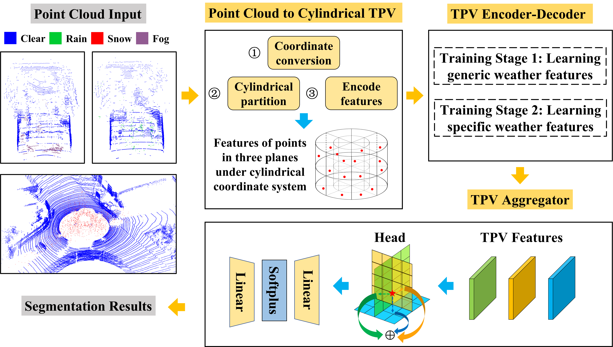
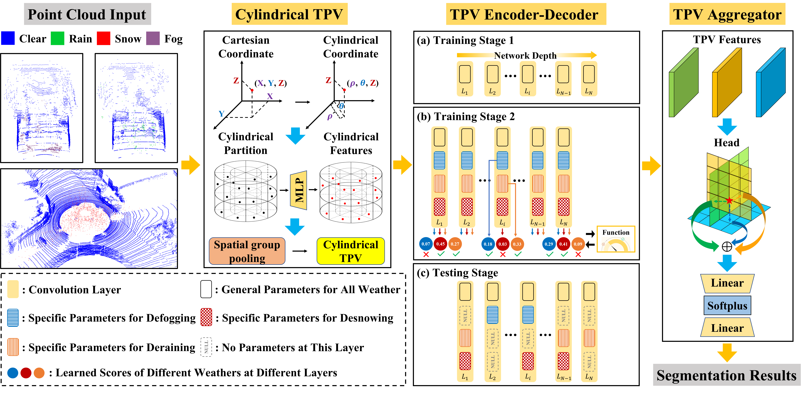
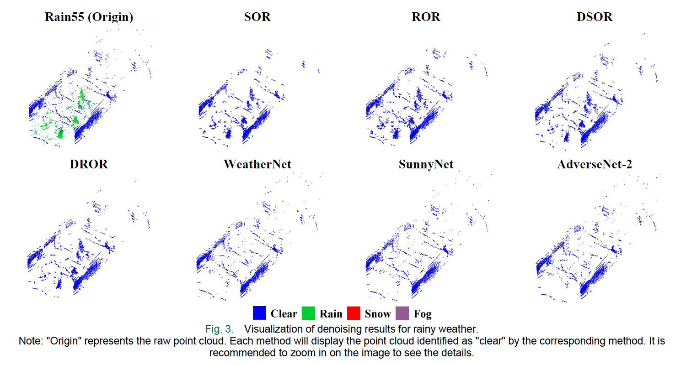
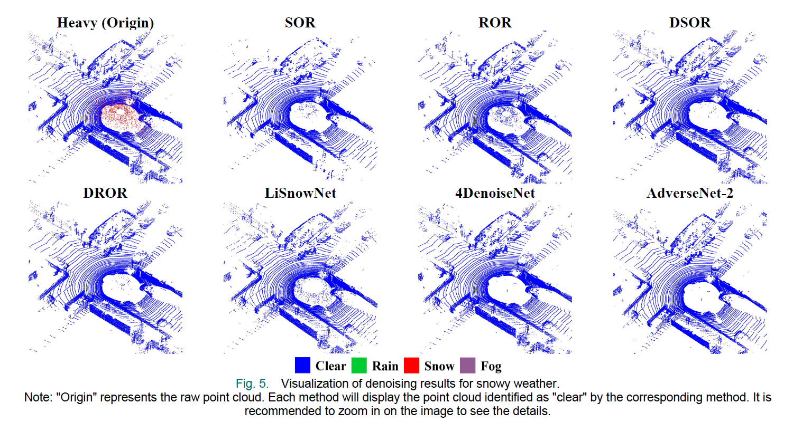
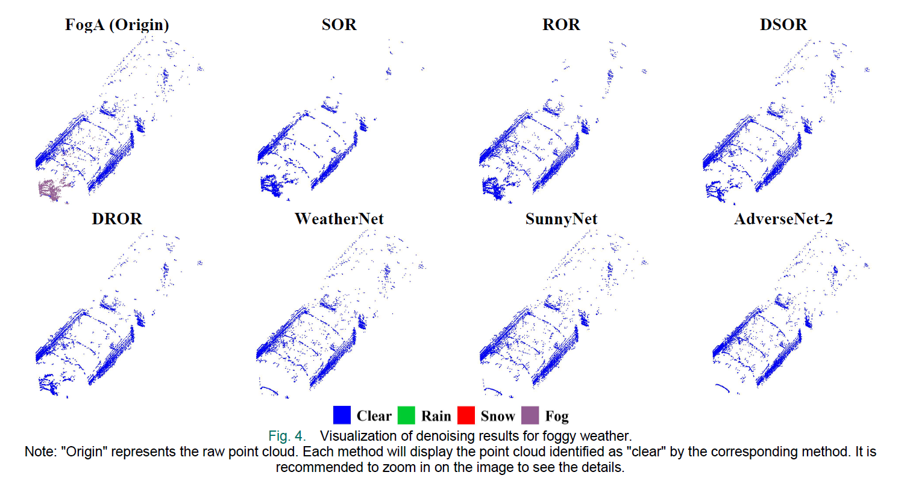
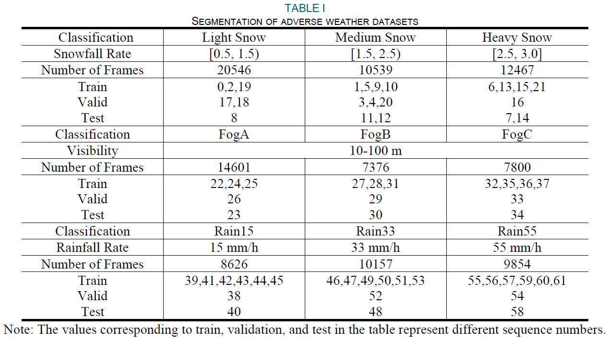

# AdverseNet: A LiDAR Point Cloud Denoising Network for Autonomous Driving in Rainy, Snowy, and Foggy Weather

### [Paper](https://ieeexplore.ieee.org/abstract/document/10832503)

> AdverseNet: A LiDAR Point Cloud Denoising Network for Autonomous Driving in Rainy, Snowy, and Foggy Weather

> [Xinyuan Yan](https://naclzno.github.io/Xinyuan-Yan/) $\dagger$, Junxing Yang $\ddagger$, Yu Liang, Yanjie Ma, Yida Li, and He Huang

$\dagger$ Project leader $\ddagger$ Corresponding author

## Highlights

- **We propose AdverseNet, a point cloud denoising network capable of simultaneously handling three types of adverse weather conditions: rain, snow, and fog. In AdverseNet, we utilize the CTPV representation for the point cloud.**
- **During the training process, we employ a two-stage training strategy. The first stage focuses on learning the generic features of different kinds of adverse weather, while the second stage concentrates on learning the specific features associated with each type of adverse weather.**

<p align="center">
    
</p>

## Abstract

In the field of autonomous driving, a pressing issue is how to enable LiDAR to accurately perceive the 3D environment around the vehicle without being affected by rain, snow, and fog. Specifically, rain, snow, and fog can be present within the LiDAR's detection range and create noise points. To address this problem, we propose a unified denoising network, AdverseNet, for adverse weather point clouds, which is capable of removing noise points caused by rain, snow, and fog from LiDAR point clouds. In AdverseNet, we adopt the Cylindrical Tri-Perspective View (CTPV) representation for point clouds and employ a two-stage training strategy. In the first training stage, generic features of rain, snow, and fog noise points are learned. In the second training stage, specific weather features are learned. We conducted comparative experiments on the DENSE dataset and the SnowyKITTI dataset, and the results show that the performance of our method on both datasets is significantly improved compared to other methods, with the Mean Intersection-over-Union (MIoU) reaching 94.67% and 99.33%, respectively. Our proposed AdverseNet enhances the LiDAR sensing capability in rain, snow, and fog, ensuring the safe operation of autonomous vehicles in adverse weather conditions.



## Qualitative Results

### Rainy Weather



### Snowy Weather



### Foggy Weather



## Installation

1. Create a conda environment and activate it.

```
conda create -n AdverseNet python=3.8
conda activate AdverseNet
```

2. Install PyTorch and torchvision following the [official instructions](https://pytorch.org/).

```
pip install torch==1.10.0+cu113 torchvision==0.11.0+cu113 torchaudio==0.10.0 -f https://download.pytorch.org/whl/torch_stable.html
```

3. Follow instructions in https://mmdetection3d.readthedocs.io/en/latest/get_started.html#installation to install mmcv-full, mmdet, mmsegmentation and mmdet3d

```
pip install -U openmim
mim install mmengine
mim install 'mmcv>=2.0.0rc4'
mim install 'mmdet>=3.0.0'
mim install mmsegmentation
mim install "mmdet3d>=1.1.0rc0"
```

4. install other packages

```
pip install timm==0.4.12
pip install torch_scatter
pip install spconv-cu113
pip install scikit-image==0.19.3
pip install pandas==1.4.4
```

## Preparing

1. You can download the DENSE dataset [here](https://www.uni-ulm.de/index.php?id=101568) (credit to Heinzler *et al.*) and the SnowyKITTI dataset [here](https://www.dropbox.com/s/o3r654cdzfl405d/snowyKITTI.zip?dl=0) (credit to Seppänen *et al.*).

2. To standardize dataset formats and remove invalid data, first run ./formats/DENSE/hdf5totxt.py to convert the DENSE format from .hdf5 to .txt. Then, use ./formats/DENSE/cnnfilter.py to filter out invalid points.

3. Similarly, use ./formats/DENSE/binlabeltotxt+filter.py to convert the SnowyKITTI format from .bin and .label to .txt while simultaneously removing invalid points.

4. According to the table below, reorganize the sequence names and divide them into their corresponding files.



## Getting Started

------

### Pretrained models
[Stage 1](https://drive.google.com/drive/folders/1B0R3SI6D5PkAJGkx_axUm6V5NpjkQllo?usp=share_link) | [Stage 2 K1](https://drive.google.com/drive/folders/1B0R3SI6D5PkAJGkx_axUm6V5NpjkQllo?usp=share_link)

### Training

1. The first training stage

   ```
   python train_Stage1.py --py-config /home/yxy/AdverseNet/config/AdverseNet_config.py --work-dir /home/yxy/work/fifth
   ```

2. The second training stage

   ```
   python train_Stage2.py --py-config /home/yxy/AdverseNet/config/AdverseNet_config.py --work-dir /home/yxy/work/fifth/K1-0.1 --flag K1 --lam 0.1
   ```

### Evaluation

1. Evaluation of the model in the first training stage

   ```
   python test_seg.py --py-config /home/yxy/AdverseNet/config/AdverseNet_config.py --ckpt-path xxx --log-file xxx --flag S1
   ```

2. Evaluation of the model in the second training stage

   ```
   python test_seg.py --py-config /home/yxy/AdverseNet/config/AdverseNet_config.py --ckpt-path xxx --log-file xxx  --flag K1
   ```

## Related Projects

Our code mainly derives from [PointOcc](https://github.com/wzzheng/PointOcc) and is also based on [WGWS-Net](https://github.com/zhuyr97/WGWS-Net). Many thanks to them!

## Contact
If you have any questions, please contact yan1075783878@gmail.com

## Citation

If you find this project helpful, please consider citing the following paper:
```
@ARTICLE{10832503,
  author={Yan, Xinyuan and Yang, Junxing and Liang, Yu and Ma, Yanjie and Li, Yida and Huang, He},
  journal={IEEE Sensors Journal}, 
  title={AdverseNet: A LiDAR Point Cloud Denoising Network for Autonomous Driving in Rainy, Snowy, and Foggy Weather}, 
  year={2025},
  volume={25},
  number={5},
  pages={8950-8961},
  doi={10.1109/JSEN.2024.3505234}}
```